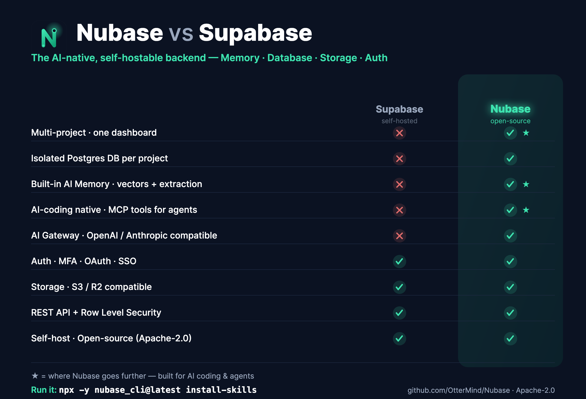

# Nubase

[English](README.md) · **简体中文**

[](LICENSE)
[](https://www.npmjs.com/package/nubase_cli)
[](https://github.com/OtterMind/Nubase)

**让 AI 写出的代码变成真正上线的应用。** Nubase 是一个开源、AI 原生的后端**与部署层**，由编码 Agent 直接驱动 —— 生成的应用几分钟内即可上线。八大能力模块集成在一个可自托管的服务中：**数据库（Database）、认证（Auth）、存储（Storage）、静态资源（Assets）、函数（Functions）、AI 网关（AI Gateway）、记忆（Memory）和定时任务（cron）**。

> Agent 可以建模数据（Database + Auth）、部署后端逻辑（**Functions**）、把生成的前端发布到公共 CDN（**Assets**）、编排周期性任务（**cron**）—— 全部通过 MCP 工具完成，无需单独的托管账号。在合理之处对齐 Supabase 体验（Postgres、REST、JWT、RLS、对象存储、Studio 控制台），并额外提供一流的 **Memory** 能力和专为 AI 编码 Agent 打造的 **MCP** 接口。

---

## ⚡ 快速开始

### 1. 在 Claude Code 或 Codex 中使用 Nubase —— 一条命令

在你的项目目录下运行：

```bash
npx -y nubase_cli@latest install-skills
```

这一条命令会：

- 📚 为 **Claude Code 和 Codex** 安装 **Nubase 技能（skills）**，
- 🔌 自动配置 **MCP server**，
- 🔐 打开浏览器完成**授权**并选择你的项目。

随后：

- **Claude Code** —— 在该目录重启，运行 `/mcp`，确认 `nubase` 已连接。
- **Codex** —— 已写入 `~/.codex/config.toml`，直接启动 Codex 即可。

> 这会把你的 Agent 连接到一个 Nubase 实例（托管的，或你自己的 —— 见第 2 步自建）。用以下方式让 CLI 指向任意实例：
> ```bash
> npx -y nubase_cli@latest install-skills \
>   --studio-url https://studio.example.com \
>   --nubase-url https://api.example.com
> ```

### 2. 运行你自己的 Nubase —— 一条命令

一体化 Docker 镜像内置了 **PostgreSQL + Redis + 后端 + Studio**：

```bash
docker run -d --name nubase \
  -p 9999:9999 -p 5432:5432 \
  -v nubase_data:/data \
  <your-namespace>/nubase:latest
```

- **Studio** → http://localhost:9999/studio —— 创建账号、创建项目，点击 **Provision** 初始化项目数据库。
- **API** → http://localhost:9999（Studio 界面已打包进后端，同端口提供）

> 首次启动的密钥会生成到 `/data` 卷中；保留该卷即可保留你的项目。如需带稳定密钥的正式部署，见 [使用 Docker 自托管](#-使用-docker-自托管)。

### 3. 用你的 Agent 构建

现在你的 Agent 可以直接通过 MCP 工具操作 Nubase —— 查看结构、创建表、执行 SQL、管理认证与存储、**部署边缘函数、把前端发布到公共 CDN、编排定时任务**，以及读写持久化 **Memory**。试着这样说：

> “创建一张带 RLS 的 `todos` 表，部署一个返回未完成数量的边缘函数，把一个调用它的单页 UI 发布到 Assets，并把这次部署记到 memory 里。”

完整的「生成 → 上线」流程见 [部署 AI 生成的应用](docs/deploy-ai-generated-apps.md)。

---

## 🚀 使用 Docker 自托管

这个一体化镜像就是在自己机器上运行 Nubase 所需的全部 —— **一行命令，无需 compose 文件，无需外部服务**。

**试用（自动生成密钥，保存在卷中）：**

```bash
docker run -d --name nubase -p 9999:9999 -p 5432:5432 \
  -v nubase_data:/data <your-namespace>/nubase:latest
```

**生产（固定稳定密钥，让加密的项目凭据在重启后依然可用）：**

```bash
docker run -d --name nubase -p 9999:9999 -p 5432:5432 \
  -v nubase_data:/data \
  -e PGRST_ENCRYPTION_MASTER_KEY="$(openssl rand -base64 32)" \
  -e METADATA_SERVICE_ROLE_KEY="$(openssl rand -base64 48)" \
  <your-namespace>/nubase:latest
```

其余一切都通过环境变量配置 —— Postgres、Redis、S3/R2 存储、SMTP、OAuth 和 LLM 厂商。完整列表及多架构（`amd64` + `arm64`）说明见 [docs/docker-all-in-one.md](docs/docker-all-in-one.md)。

> 把 `<your-namespace>` 替换为镜像发布所在的 Docker Hub 命名空间。

---

## 为什么选择 Nubase

AI 原生应用需要的远不止 CRUD。从第一天起，它们就需要用户记忆、检索、认证、存储、数据库 API 和项目隔离。没有这层后端，每一次 AI 编码都只能产出又一个还需要数周基础设施工作的 Demo。

Supabase 非常优秀，但它开源自托管的技术栈是围绕**单个**项目设计的。Nubase 面向那些希望在自己基础设施上拥有**一个 Studio、一个后端服务、多个相互隔离的 AI 项目**的 AI 团队和自托管用户，并带来三项有主张的增强：

1. **Memory 是一等原语** —— 持久化记忆、实体抽取、历史记录和混合检索都内建其中，而不是额外挂一个向量库脚本。
2. **AI 编码有了真正的后端目标** —— Agent 通过 MCP 友好的工具创建表、调用 REST API、写入记忆、查看结构。
3. **自托管支持多项目** —— 单一控制平面负责开通并路由到多个相互隔离的项目数据库。

## 核心能力

- **🗄️ 数据库（Database）** —— 每个项目一个隔离的 PostgreSQL；兼容 PostgREST 的 `/rest/v1` API（select/filter/order/分页/insert/update/upsert/delete）；按项目维度的 JWT 密钥、角色和结构缓存；基于 JWT claims 的行级安全（RLS）。
- **🔐 认证（Auth）** —— Supabase 风格的注册/登录与刷新令牌轮换；MFA/TOTP、OTP 与魔法链接、匿名登录；OAuth（Google / GitHub / 微信）与 SAML SSO；按项目维度的 `anon` / `authenticated` / `service_role` 令牌。
- **📦 存储（Storage）** —— 兼容 S3（Cloudflare R2 / AWS S3 / MinIO）；公开/私有 bucket、签名 URL、大小与 MIME 控制；面向大型文档/资源场景的可选 S3 Vectors。
- **🌐 静态资源 / CDN（Assets）** —— 发布生成的前端：按项目维度的公共静态资源，经 `/assets/v1/**` 提供，带 Cache-Control/ETag/304 语义；可设项目默认缓存策略和自定义 CDN 域名；Agent 通过 MCP 直接发布（`assets_upload`）。
- **⚡ 函数（Functions）** —— 把后端逻辑部署为边缘函数，经 `/functions/v1/**` 提供；按函数维度的密钥、调用日志、限流、`verify_jwt`；支持本地执行器或 Cloudflare Workers for Platforms；Agent 通过 MCP 脚手架/部署/调用（`functions_deploy`）。
- **🤖 AI 网关（AI Gateway）** —— 兼容 OpenAI 与 Anthropic 的接口，带按项目维度的密钥和 token/成本用量统计。
- **🧠 记忆（Memory）** —— Mem0 风格的 Memory API；由 LLM 驱动的事实抽取（ADD/UPDATE/DELETE/NONE）；基于 pgvector + Postgres 全文检索 + 实体加权的混合检索；实体存储与仅追加的历史记录。支持 OpenAI、Anthropic 及兼容 OpenAI 的厂商。
- **⏰ 定时任务（cron）** —— 按 crontab 计划周期性调用某个边缘函数或具名数据库函数，由控制平面执行并保留运行历史；通过 MCP 管理（`cron_create`）。
- **🧰 AI 编码与 Agent** —— 一个 MCP 桥（`nubase_cli`），用于结构查看、SQL 执行、RLS 导出、项目初始化和记忆；在 Auth、REST、Storage、Memory 之间统一的项目令牌模型。
- **🎛️ Studio** —— 一个 Next.js 控制台，管理项目、SQL（带执行历史）、用户、存储和记忆浏览器。

## Nubase vs Supabase



<details>
<summary>完整对比表（含 Supabase Cloud）</summary>

| 维度 | Supabase Cloud | Supabase 自托管 | Nubase |
| --- | --- | --- | --- |
| 多项目控制台 | 有 | 无（模拟单项目） | **有** |
| 项目隔离 | 独立实例 | 单个本地项目 | **每项目独立的 Postgres 数据库** |
| 数据库 API | PostgREST | PostgREST | 兼容 PostgREST（Java 实现） |
| 认证 | 有 | 有 | Supabase 风格认证 |
| 存储 | 有 | 有 | 兼容 S3/R2 |
| AI 记忆 | 非核心原语 | 非核心原语 | **内建 Memory 支柱** |
| AI 编码后端目标 | 通用原语 | 通用原语 | **Memory + REST + MCP + Studio** |
| 部署生成的应用 | 应用 + 单独的托管/Functions/cron | 自行管理整套技术栈 | **前端（Assets）+ 后端（Functions）+ cron，一个平台** |
| 边缘函数 | 有 | 技术栈内提供 | **网关 + 执行器（本地 / Cloudflare WfP）** |
| 实时（Realtime） | 有 | 技术栈内提供 | 暂未支持 |

</details>

## 架构

Nubase 有两层数据库：

- **元数据库（Metadata database）** —— 平台用户、项目配置、加密的项目凭据、归属关系、平台设置、SQL 片段和执行记录。
- **项目数据库（Project databases）** —— 每个项目拥有自己的 PostgreSQL 数据库，内含认证表、存储元数据、记忆表和应用表。

请求使用双令牌模型：`apikey` 标识项目 + 角色（`anon` / `authenticated` / `service_role`），`Authorization: Bearer <jwt>` 标识终端用户，用于 RLS 和记忆归属。请求过滤器从 `apikey` 解析出项目，把 JDBC 路由到正确的项目数据库，并设置请求上下文。

## 从源码运行（开发）

环境要求：Java 17、Maven、Docker、Node.js + pnpm。

```bash
# 1. 启动 Postgres（15 + pgvector）
docker compose -f pg-docker-compose.yml up -d

# 2. 必需密钥
export PGRST_ENCRYPTION_MASTER_KEY="$(openssl rand -base64 32)"
export METADATA_SERVICE_ROLE_KEY="replace-with-a-long-random-admin-token"
export OPENAI_API_KEY="sk-..."   # 可选，仅用于 LLM 驱动的 Memory

# 3. 后端 → http://localhost:9999
mvn spring-boot:run

# 4. Studio → http://localhost:3000
cd frontend && pnpm install && pnpm dev:studio
```

自行构建一体化镜像：`docker build -f Dockerfile.all-in-one -t nubase:local .`

## 示例

**写入并检索记忆：**

```bash
curl -X POST http://localhost:9999/mem/v1/memories \
  -H "apikey: $NUBASE_SERVICE_KEY" -H "Content-Type: application/json" \
  -d '{"userId":"user-42","messages":[{"role":"user","content":"I prefer steak over sushi and my dog is named Mochi."}]}'

curl -X POST http://localhost:9999/mem/v1/search \
  -H "apikey: $NUBASE_SERVICE_KEY" -H "Content-Type: application/json" \
  -d '{"userId":"user-42","query":"what food do they like?"}'
```

**使用 REST API**（先创建一张 `todos` 表）：

```bash
curl "http://localhost:9999/rest/v1/todos?select=*" -H "apikey: $NUBASE_ANON_KEY"

curl -X POST "http://localhost:9999/rest/v1/todos" \
  -H "apikey: $NUBASE_SERVICE_KEY" -H "Content-Type: application/json" \
  -d '{"text":"Ship the first open-source release"}'
```

## 文档

- [快速上手](docs/getting-started.md)
- [部署 AI 生成的应用（生成 → 上线）](docs/deploy-ai-generated-apps.md)
- [连接 Agent（Claude / Codex / Cursor）](docs/agent-connect.md)
- [MCP 与 Agent 指南](docs/mcp.md)
- [边缘函数](docs/edge-functions.md) · [静态资源 CDN（Assets）](docs/assets.md) · [定时任务（cron）](docs/scheduled-jobs.md)
- [nubase_cli 使用说明](docs/nubase-cli-usage.md)
- [一体化 Docker 镜像](docs/docker-all-in-one.md)
- [架构](docs/architecture.md)
- [产品总览](docs/product-overview.md)
- [Supabase 对比](docs/supabase-comparison.md)

> 注：上述文档目前为英文版，欢迎贡献中文翻译。

## 状态与路线图

Nubase 仍处于早期阶段，但全部八大模块（数据库、认证、存储、静态资源、函数、AI 网关、记忆、定时任务）以及 Studio 和 MCP 桥都已就位。尚未实现：**实时（Realtime）**，以及备份/PITR、高可用、企业级 SSO/SCIM 等运维增强。在把服务暴露到公网之前，请先审查管理类接口。

## 贡献

欢迎贡献与提 issue —— 见 [CONTRIBUTING.md](CONTRIBUTING.md) 和 [SECURITY.md](SECURITY.md)。这是早期公开版本，你的反馈会塑造它接下来的方向。🙌

## 许可证

[Apache-2.0](LICENSE)。
